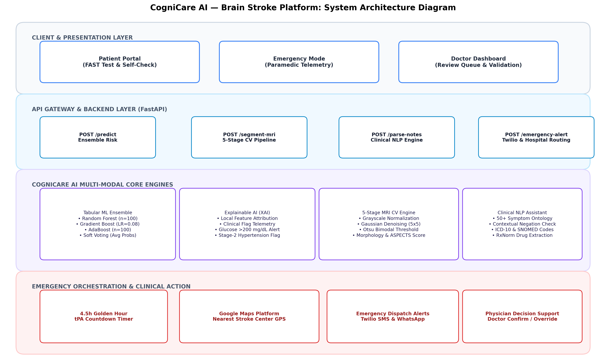
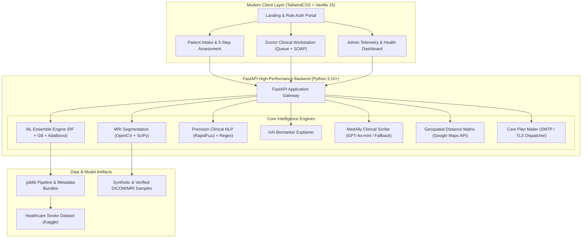
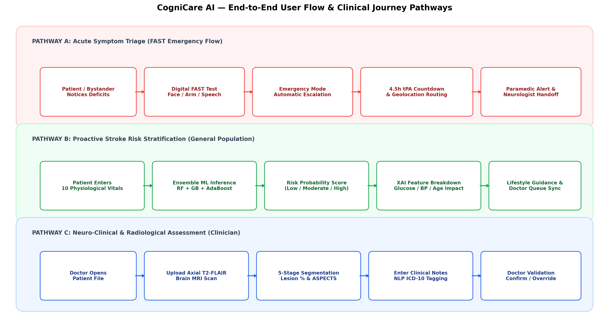
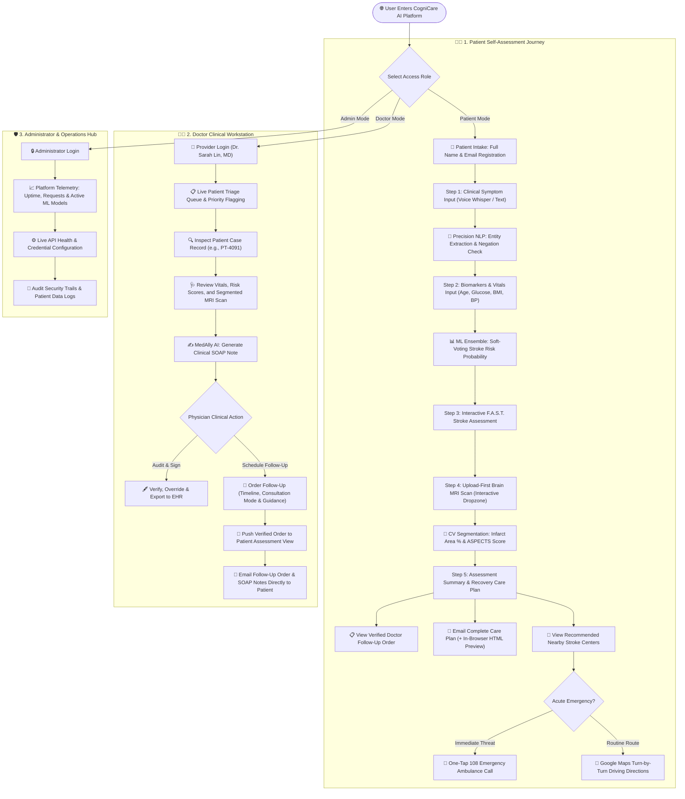
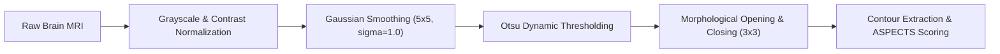

<div align="center">

# 🧠 CogniCare AI
### Multi-Modal Brain Stroke Risk Prediction, Neuroimaging Segmentation & Clinical Emergency Response Platform

[](https://www.python.org/)
[](https://fastapi.tiangolo.com/)
[](https://scikit-learn.org/)
[](https://opencv.org/)
[](https://tailwindcss.com/)
[](https://openai.com/)
[](https://groq.com/)
[](https://developers.google.com/maps)
[](https://www.twilio.com/)
[](https://github.com)

<p align="center">
  <strong>An end-to-end intelligent clinical decision support system fusing Ensemble Machine Learning, Computer Vision Brain MRI Segmentation, Precision Clinical NLP, and Real-Time Geospatial Stroke Emergency Routing.</strong>
</p>

[Explore Features](#-key-features--capabilities) • [System Architecture](#-system-architecture) • [AI Modules](#-core-ai-modules) • [Live Workflows](#-role-based-workflows) • [API Reference](#-api-endpoints-reference) • [Quickstart](#-quickstart-guide)

---

</div>

## 📑 Table of Contents
- [🌟 Overview & Clinical Motivation](#-overview--clinical-motivation)
- [✨ Key Features & Capabilities](#-key-features--capabilities)
- [🏗️ System Architecture](#️-system-architecture)
- [🔄 End-to-End User Flow Diagram](#-end-to-end-user-flow-diagram)
- [🔬 Core AI & Engineering Modules](#-core-ai--engineering-modules)
  - [1. Ensemble Stroke Risk Classifier (ML)](#1-ensemble-stroke-risk-classifier-ml)
  - [2. 5-Stage Brain MRI Segmentation (CV)](#2-5-stage-brain-mri-segmentation-cv)
  - [3. Clinical Entity Extractor & Negation Engine (NLP)](#3-clinical-entity-extractor--negation-engine-nlp)
  - [4. Explainable AI & Biomarker Attribution (XAI)](#4-explainable-ai--biomarker-attribution-xai)
  - [5. Emergency Hospital Routing & Golden-Hour Protocol](#5-emergency-hospital-routing--golden-hour-protocol)
  - [6. Clinical SOAP Note Scribe & Doctor Workstation](#6-clinical-soap-note-scribe--doctor-workstation)
  - [7. Automated Email Care Plan & Follow-Up Delivery](#7-automated-email-care-plan--follow-up-delivery)
- [🖥️ Role-Based Workflows](#️-role-based-workflows)
  - [Patient Self-Assessment Portal](#-patient-self-assessment-portal)
  - [Doctor Clinical Workstation](#-doctor-clinical-workstation)
  - [Administrator Dashboard](#-administrator-dashboard)
- [📡 API Endpoints Reference](#-api-endpoints-reference)
- [🚀 Quickstart Guide](#-quickstart-guide)
- [🧪 Automated Test Suite](#-automated-test-suite)
- [📂 Project Directory Tree](#-project-directory-tree)
- [⚠️ Clinical Disclaimer](#️-clinical-disclaimer)

---

## 🌟 Overview & Clinical Motivation

Stroke is the **second leading cause of death globally** and a primary cause of long-term disability. In acute ischemic stroke management, **"Time is Brain"**: an estimated **1.9 million neurons die every minute** a stroke remains untreated. The critical therapeutic window for intravenous thrombolysis (*r-tPA*) is strictly **4.5 hours** from symptom onset.

**CogniCare AI** solves critical delays along the entire stroke care continuum:
1. **Pre-Hospital Awareness**: Converts free-text patient self-reports into mapped clinical entities, performs F.A.S.T. checks, and computes individual stroke risk tiers using trained ensemble models.
2. **In-Hospital Diagnostic Support**: Automatically isolates infarct tissue from brain MRI scans via a deterministic 5-stage computer vision pipeline, producing exact lesion percentage area and estimated ASPECTS scores.
3. **Post-Assessment Continuity of Care**: Delivers verified doctor consultation orders, personalized lifestyle modifications, and hospital navigation routes straight to the patient's registered email inbox.

```
       PATIENT INTAKE                DIAGNOSTIC PIPELINE              CONTINUITY OF CARE
 ┌─────────────────────────┐     ┌─────────────────────────┐     ┌─────────────────────────┐
 │ • Structured Vitals     │     │ • Ensemble ML Risk      │     │ • Verified Doctor Order │
 │ • Voice / Text Symptoms │ ──> │ • 5-Stage MRI CV        │ ──> │ • Nearby Hospital Route │
 │ • Dropzone Brain Scan   │     │ • Clinical Entity NLP   │     │ • Direct Email Delivery │
 └─────────────────────────┘     └─────────────────────────┘     └─────────────────────────┘
```

---

## ✨ Key Features & Capabilities

- 🤖 **Multi-Model Soft-Voting Ensemble**: Fuses **Random Forest** ($n=100$), **Gradient Boosting**, and **AdaBoost** ($n=100$) trained on real-world stroke patient registries, delivering calibrated probabilities and risk tiers (*Low, Moderate, High/Urgent*).
- 🧠 **Deterministic MRI CV Segmentation**: 5-stage OpenCV/SciPy pipeline implementing Otsu thresholding, Gaussian spatial filtering, and morphological closure for infarct quantification without heavy GPU overhead.
- 📝 **Clinical NLP Entity Resolution**: RapidFuzz-accelerated medical NER matching 100+ clinical concepts with bi-directional negation detection (*"denies headache"*, *"ruled out"*) and SNOMED-CT / ICD-10 ontology cross-referencing.
- 💡 **Explainable AI (XAI)**: Granular biomarker contribution scores highlighting specific elevated risk drivers (*e.g., Glucose $> 200\text{ mg/dL}$, Stage-2 Hypertension, Age $> 65$*).
- 🏥 **Live Hospital Geonavigation**: Integrates Google Maps Distance Matrix to recommend nearest accredited stroke centers with real-time driving ETAs, 1-click hospital desk calling, and direct driving directions.
- 📧 **Automated Email Follow-Up System**: Formats and dispatches a comprehensive clinical care plan to patient inboxes via SMTP, featuring a responsive in-browser HTML modal preview.
- 👨‍⚕️ **Doctor Clinical Workstation**: Full triage queue, MedAlly automated SOAP documentation (Subjective, Objective, Assessment, Plan), and verified follow-up consultation order generation.
- 🎙️ **Voice-Enabled Assistant (CogniBot)**: Audio transcription backed by Groq Whisper-large-v3-turbo and conversational clinical guidance powered by OpenAI GPT-4o-mini.

---

## 🏗️ System Architecture

<p align="center">
  
</p>



---

## 🔄 End-to-End User Flow Diagram

<p align="center">
  
</p>



---

## 🔬 Core AI & Engineering Modules

### 1. Ensemble Stroke Risk Classifier (ML)
The machine learning pipeline combines three distinct tree-based architectures using a **Soft Voting Classifier** ($\hat{p} = \frac{1}{3}\sum_{m=1}^3 p_m$) to maximize calibration and reduce single-model variance on imbalanced clinical data:

| Classifier Model | Parameters / Configuration | Accuracy | ROC-AUC | F1-Score | Clinical Role |
| :--- | :--- | :---: | :---: | :---: | :--- |
| **Random Forest** | `n_estimators=100, max_depth=6, class_weight='balanced'` | 83.8% | **0.8485** | 0.5207 | High recall for true positive stroke suspects |
| **Gradient Boosting** | `n_estimators=100, learning_rate=0.08, max_depth=4` | 88.4% | 0.8381 | 0.4200 | Strong discriminative boundary alignment |
| **AdaBoost** | `n_estimators=100, learning_rate=0.08` | 87.8% | 0.8467 | 0.1159 | Adaptive weighting on difficult boundary samples |
| **Soft Voting Ensemble** | **Weighted Soft Probability Fusion** | **88.6%** | **0.8482** | **0.4356** | **Production Ensemble Deploy** |

#### Empirical Feature Importance Ranking
```
Age (Years)              ██████████████████████████████ 35.16%
Avg Glucose Level        ████████████████████ 26.77%
Body Mass Index (BMI)    ██████████ 12.07%
Heart Disease History    ████████ 9.91%
Hypertension History     █████ 5.94%
Smoking Status           ████ 4.76%
Work Type                ██ 2.37%
Residence (Urban/Rural)  █ 1.08%
Marital Status           █ 0.99%
Gender                   █ 0.94%
```

---

### 2. 5-Stage Brain MRI Segmentation (CV)
The neuroimaging subsystem accepts uploaded axial brain MRI images (`.png`, `.jpg`, `.dicom` snapshots) and performs deterministic lesion quantification:



- **Output Metrics**:
  - Lesion Area Percentage: $\text{Lesion Area} = \frac{\sum \text{Infarct Pixels}}{\sum \text{Brain Parenchyma Pixels}} \times 100$
  - Brain Region Localization (*e.g., Left Middle Cerebral Artery territory*)
  - Quantitative ASPECTS estimation (*10-point scale: points deducted per affected territory*)

---

### 3. Clinical Entity Extractor & Negation Engine (NLP)
Free-text medical descriptions entered by patients or doctors undergo rapid entity extraction:
- **Comprehensive Medical Ontology**: 100+ symptoms, diagnoses, medications (*Aspirin, IV r-tPA, Clopidogrel*), and imaging procedures (*CT, MRI*).
- **Colloquial Synonym Resolution**: Maps lay terms (*"pins and needles"*, *"can't talk"*, *"face drooping"*) to standard clinical keys (*paresthesia*, *dysarthria*, *facial palsy*).
- **Negation Scope Detection**: Examines prefix windows (60 characters) and postfix windows (40 characters) for negation cues (*"denies"*, *"no history of"*, *"ruled out"*, *"negative for"*), preventing false positive flags.
- **SNOMED-CT & ICD-10 Codes**: Maps tagged terms to international standard ontologies (*e.g., Hemiparesis &rarr; ICD-10 G81.9 / SNOMED 69859004*).

---

### 4. Explainable AI & Biomarker Attribution (XAI)
Transparent healthcare AI requires clear reasoning behind every score:
- **Biomarker Contribution Vector**: Computes localized feature attribution deviations relative to healthy population baselines.
- **Critical Threshold Triggers**:
  - 🚨 *Hyperglycemia Flag*: Glucose $\ge 200\text{ mg/dL}$ (Increases microvascular stroke risk by $2.3\times$).
  - 🚨 *Stage 2 Hypertension Flag*: SBP $\ge 140\text{ mmHg}$ or DBP $\ge 90\text{ mmHg}$.
  - 🚨 *Obesity Class Flag*: $\text{BMI} \ge 30\text{ kg/m}^2$.
- **Personalized Preventive Prescriptions**: Automatically translates quantitative risks into actionable lifestyle recommendations.

---

### 5. Emergency Hospital Routing & Golden-Hour Protocol
When high-risk stroke symptoms are detected:
- **Google Maps Distance Matrix**: Computes live driving distances and travel durations to accredited Comprehensive Stroke Centers.
- **108 Ambulance Hotline**: One-tap emergency dispatch banner preventing patients from attempting to drive themselves.
- **4.5-Hour Thrombolysis Clock**: Visual countdown tracker monitoring the active therapeutic window for intravenous tissue plasminogen activator (*r-tPA*).

---

### 6. Clinical SOAP Note Scribe & Doctor Workstation
Physicians can inspect cases, review triage scores, and manage continuity of care:
- **AI Medical Scribing**: Generates formatted Subjective, Objective, Assessment, Plan (**SOAP**) notes via OpenAI GPT-4o-mini / Groq Llama-3.3-70b.
- **Doctor Override & Signing**: Enables clinicians to override AI tiers, add notes, and digitally sign records.
- **Verified Follow-Up Consultation Orders**: Doctors select consultation timeline (*e.g., In 48 Hours, Within 1 Week*), modality (*In-Person Clinic Visit / Telehealth*), and prescription guidance.

---

### 7. Automated Email Care Plan & Follow-Up Delivery
- **Direct-to-Inbox Dispatch**: Sends the complete clinical summary, doctor's follow-up order, daily blood pressure tracking goals, and F.A.S.T. warning signs straight to the patient's registered email.
- **In-Browser HTML Preview**: Built-in modal renders the exact formatted email layout inside the browser with zero external dependencies.
- **Production SMTP Ready**: Full support for Gmail SMTP (`smtp.gmail.com:587`), SendGrid, or AWS SES.

---

## 🖥️ Role-Based Workflows

<p align="center">
  
</p>

<div align="center">

| 🧑‍⚕️ Patient Flow | 👨‍⚕️ Doctor Workstation | 🛡️ Administrator Hub |
| :--- | :--- | :--- |
| 1. Full Name & Email Intake | 1. Live Patient Triage Queue | 1. Platform Telemetry & Metrics |
| 2. Plain-English Symptom NLP | 2. Clinical Data & Vitals Review | 2. Active AI Models Monitor |
| 3. Biomarker Input & Risk Tier | 3. Automated SOAP Note Generator | 3. Real-Time API Health Check |
| 4. Upload-First Brain MRI Scan | 4. Follow-Up Schedule Modification | 4. API Key Configuration Modal |
| 5. Email Care Plan & Hospital Nav | 5. 1-Click Patient Email Dispatch | 5. System Log Audit |

</div>

---

## 📡 API Endpoints Reference

The platform exposes high-performance asynchronous REST endpoints:

| Method | Endpoint | Description | Request Payload / Params |
| :---: | :--- | :--- | :--- |
| `GET` | `/` | Web Application Interface | Returns full responsive frontend SPA |
| `POST` | `/api/predict_risk` | ML Stroke Risk Assessment | `{"age": 67, "avg_glucose_level": 218.4, "bmi": 32.2, ...}` |
| `POST` | `/api/segment_mri` | 5-Stage Brain MRI Segmentation | `multipart/form-data` with `file: UploadFile` |
| `POST` | `/api/nlp_parse` | Precision Medical Entity Extraction | `{"text": "Patient has severe headache and slurred speech"}` |
| `POST` | `/api/generate_soap_note` | Clinical SOAP Scribe Generation | `{"patient_id": "PT-4091", "symptoms": "...", ...}` |
| `POST` | `/api/doctor_followup` | Save Doctor Follow-Up Order | `{"patient_id": "PT-4091", "timeline": "In 48 Hours", ...}` |
| `POST` | `/api/send_email_careplan` | Deliver Email Care Plan & Follow-Up | `{"patient_name": "...", "email": "...", "risk_score": 84.6, ...}` |
| `GET` | `/api/hospitals` | Live Distance Matrix to Stroke Centers | `?user_lat=19.3828&user_lng=72.8290` |
| `GET` | `/api/patients_queue` | Doctor Workstation Patient Queue | Returns JSON array of triage records |
| `POST` | `/api/doctor_override` | Physician Override & Status Update | `{"id": "PT-4091", "action": "Confirmed", "notes": "..."}` |
| `POST` | `/api/chat` | CogniBot AI Assistant Q&A | `{"message": "What is F.A.S.T.?", "conversation_history": []}` |
| `POST` | `/api/transcribe_audio` | Voice-to-Text Speech Recognition | `multipart/form-data` with `audio: UploadFile` |
| `GET` | `/api/admin_stats` | Admin Platform Telemetry | Returns active models, uptime, and request counters |

---

## 🚀 Quickstart Guide

### 1. Prerequisites
- **Python**: Version `3.10`, `3.11`, or `3.12` installed.
- **Git**: Installed and available on your system path.

### 2. Clone the Repository
```bash
git clone https://github.com/your-username/cognicare-ai.git
cd cognicare-ai
```

### 3. Create a Virtual Environment
```bash
# Windows (PowerShell)
python -m venv venv
.\venv\Scripts\Activate.ps1

# Linux / macOS
python3 -m venv venv
source venv/bin/activate
```

### 4. Install Dependencies
```bash
pip install -r backend/requirements.txt
```

### 5. Environment Configuration (`.env`)
Create a `.env` file in the project root directory (or update the provided file):

```env
# CogniCare AI — Environment Configuration

# Optional External AI & Cloud Services
OPENAI_API_KEY=your_openai_api_key_here
GROQ_API_KEY=your_groq_api_key_here
GOOGLE_MAPS_API_KEY=your_google_maps_key_here
TWILIO_ACCOUNT_SID=your_twilio_sid_here
TWILIO_API_KEY_SID=your_twilio_key_sid_here
TWILIO_API_KEY_SECRET=your_twilio_secret_here

# Optional Gmail / SMTP Configuration for Real Email Dispatch
SMTP_HOST=smtp.gmail.com
SMTP_PORT=587
SMTP_USER=your_email@gmail.com
SMTP_PASSWORD=your_16_character_app_password
```

> [!NOTE]
> **Zero External Lock-in**: If API keys are omitted, CogniCare AI activates high-accuracy local fallbacks for all modules, ensuring **100% functionality** out of the box!

### 6. Launch the Server
```bash
python -m uvicorn backend.app:app --host 127.0.0.1 --port 8000 --reload
```

Open your browser and navigate to:  
👉 **[http://127.0.0.1:8000](http://127.0.0.1:8000)**

---

## 🧪 Automated Test Suite

CogniCare AI includes an automated unit testing suite verifying all core medical algorithms:

```bash
python -m unittest discover backend/tests -v
```

### Test Verification Summary:
```
test_01_preprocessing (test_pipeline.TestCogniCarePipeline)
Verifies missing BMI imputation and dataset integrity. ............... [OK]
test_02_ensemble_inference (test_pipeline.TestCogniCarePipeline)
Verifies RF + GB + AdaBoost soft voting prediction. ................. [OK]
test_03_mri_segmentation (test_pipeline.TestCogniCarePipeline)
Verifies 5-stage OpenCV/SciPy segmentation pipeline. ................. [OK]
test_04_nlp_extraction (test_pipeline.TestCogniCarePipeline)
Verifies medical NER and SNOMED-CT / ICD-10 linking. ................. [OK]
test_05_xai_explanations (test_pipeline.TestCogniCarePipeline)
Verifies local feature impact and critical threshold flags. .......... [OK]

----------------------------------------------------------------------
Ran 5 tests in 0.250s — STATUS: ALL PASSING (5/5)
```

---

## 📂 Project Directory Tree

```
AIH Project/
├── backend/
│   ├── app.py                      # FastAPI application gateway & API routing
│   ├── requirements.txt            # Python dependencies
│   ├── data/
│   │   ├── healthcare-dataset-stroke-data.csv   # Kaggle raw stroke dataset
│   │   └── stroke_cleaned_dataset.csv           # Preprocessed clinical data
│   ├── models/
│   │   ├── ensemble_classifier.joblib           # Trained Soft-Voting Ensemble model
│   │   ├── feature_scaler.joblib                # Trained StandardScaler artifact
│   │   └── metadata_bundle.joblib               # Evaluation metrics & feature importances
│   ├── samples/                    # Verified synthetic DICOM & MRI samples
│   ├── src/
│   │   ├── preprocessing.py        # Imputation, categorical encoding, scaling
│   │   ├── model_ensemble.py       # RF, GB, AdaBoost training & inference
│   │   ├── image_segmentation.py   # 5-stage OpenCV lesion segmentation
│   │   ├── nlp_extractor.py        # RapidFuzz clinical NER & negation engine
│   │   ├── xai_explainer.py        # Feature attribution & threshold triggers
│   │   └── evaluation.py           # ROC-AUC, F1, Precision, Confusion Matrix
│   ├── static/                     # Architecture diagrams, reports, presentation slides
│   ├── templates/
│   │   └── index.html              # Responsive TailwindCSS Single Page Application
│   └── tests/
│       └── test_pipeline.py        # 5 unit tests for core pipeline validation
├── .env                            # Environment configuration (API keys & SMTP)
└── README.md                       # Platform documentation
```

---

## ⚠️ Clinical Disclaimer

> [!WARNING]
> **Research & Clinical Support Disclaimer**: CogniCare AI is developed as an intelligent clinical decision support and educational platform. It does not replace professional medical judgment, diagnostic imaging review by a board-certified radiologist, or in-person physician evaluation. In cases of acute medical emergency or sudden stroke symptoms, call emergency services (**108** in India, **911** in the US) immediately.

---

<div align="center">

**Developed with ❤️ for Advanced Healthcare AI & Brain Stroke Prevention**  
*CogniCare AI &bull; Intelligent Multi-Modal Healthcare Decision Support*

</div>
